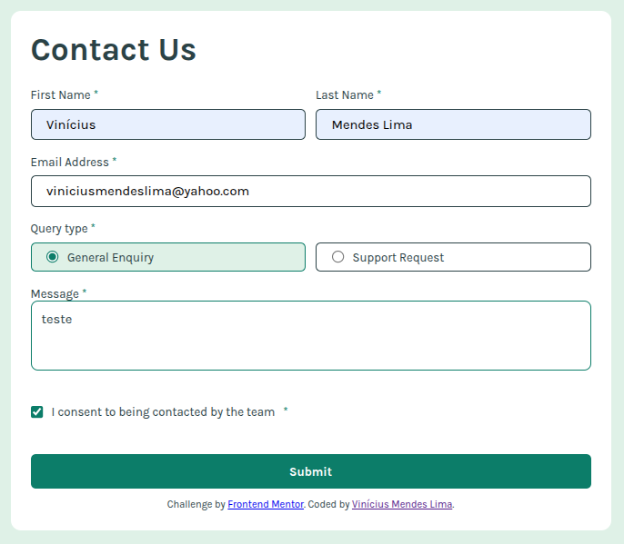

# Frontend Mentor - Contact form

## O Desafio

Criar este formulário de contato e torná-lo o mais próximo possível do design. Preste atenção especial em tornar este formulário acessível. Criar formulários acessíveis é uma habilidade fundamental para desenvolvedores front-end. Portanto, este é um desafio perfeito para praticar.

Você pode usar qualquer ferramenta que desejar para ajudá-lo a completar o desafio. Então, se você tem algo que gostaria de praticar, sinta-se à vontade para tentar.

## 🧰 Tecnologias Utilizadas

- HTML5
- CSS3
  - Importação de fontes com Google Fonts (`Karla`)
  - Layout responsivo com media queries
  - Feedback visual com mudança de bordas
- JavaScript

## 💡 Funcionalidades

- Preencher o formulário e ver uma mensagem de sucesso após o envio
- Receber mensagens de validação do formulário se:
- Um campo obrigatório estiver faltando
- O endereço de e-mail não estiver formatado corretamente
- Preencher o formulário usando apenas o teclado
---
     Pressione Tab até chegar ao primeiro campo (firstName, por exemplo).
---
    Quando chegar nos botões de radio (queryType):

    Use Tab para entrar na primeira opção (General Enquiry).

    Pressione Espaço para selecionar.

    Ou use setas (→ / ↓) para navegar entre opções (dependendo do navegador).
---
    Continue com Tab para o checkbox de consentimento.

    Use Espaço para marcar.
---
    Tab até o botão de envio (btnSend).

    Pressione Enter para enviar.
    
- Ter entradas, mensagens de erro e a mensagem de sucesso anunciadas no leitor de tela
- Visualizar o layout ideal para a interface, dependendo do tamanho da tela do dispositivo
- Ver os estados de foco e foco para todos os elementos interativos na página

